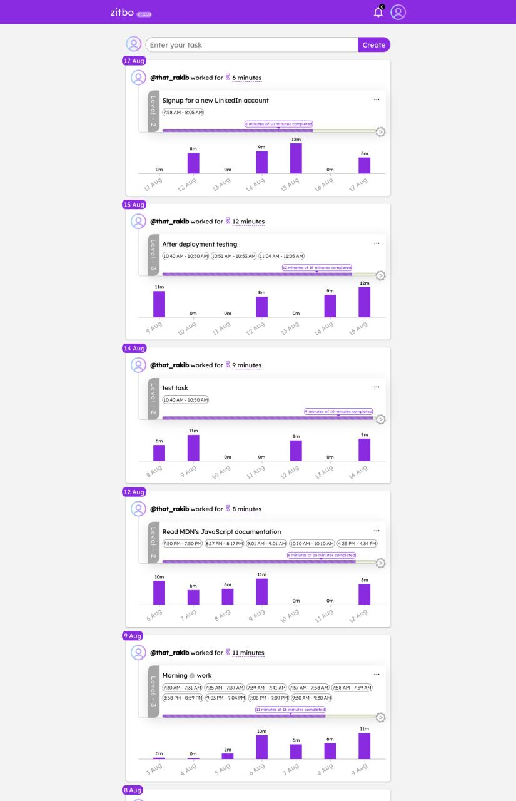

# ZITBO | Your Progress Timeline

### Live App: [https://zitbo.onrender.com/](https://zitbo.onrender.com/)

During my school days, I used to record time spans, such as 7:00pm - 8:00pm, for each study session throughout the day. This habit allowed me to calculate the cumulative study time for each day. Continuously practicing this ritual not only showcased my progress but also served as a motivational tool. This personal experience ignited the inspiration behind the development of ZITBO.

ZITBO empowers users with efficient task management while meticulously tracking time intervals associated with each task throughout the day.

A noteworthy concept of elastic habit is applied within the app during task creation. Each task involves three target times for three levels, encouraging users to accomplish a scaled-down version of their task. This feature also allows users to see how much of their target time of the current level they've completed.

In addition to displaying the cumulative time invested in tasks for each day, the application presents this data through an informative bar chart. This chart visually illustrates progress over the preceding seven days, right beneath each day's tasks.

One of the app's standout features is its infinite scrolling mechanism, enabling users to smoothly navigate through their historical task timeline and observe their progress simply by scrolling.

As the sole initiator and developer of this project, I have been involved in its creation from the ground up, and I am currently spearheading its ongoing development.

This journey has enabled me to acquire a plethora of skills.

Notably, I managed to seamlessly handle the real-time communication, simultaneous use of multiple devices by the same user and ensure smooth user disconnections using socket.io. Moreover, I overcame the challenge of presenting the bar chart as this endeavor required intricate MongoDB aggregation techniques on the backend.

Crafting comprehensive multi-step authentication forms using React Hook Form was a task that demanded several days to accomplish.

