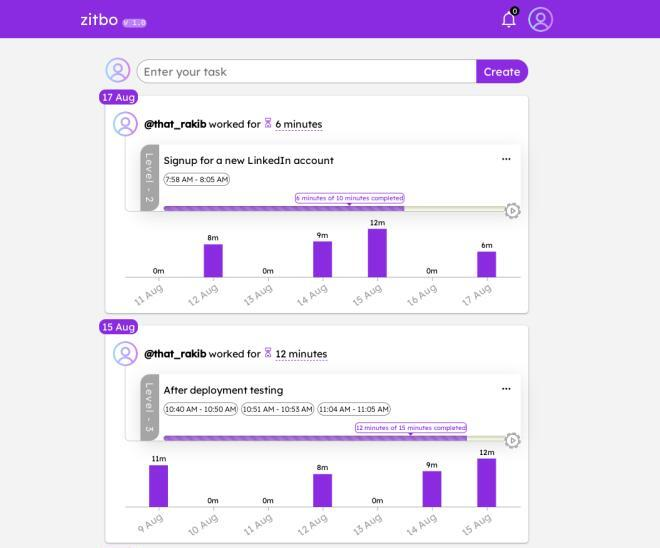
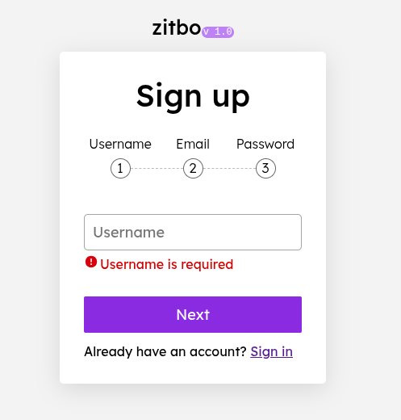

## 🚀 ZITBO | Your Progress Timeline

> **Live Demo:** [https://zitbo.onrender.com](https://zitbo.onrender.com/)

> **Backend Repo:** [https://github.com/hassanrakib/zitbo-server](https://github.com/hassanrakib/zitbo-server)

> **Test Account:** email: that_rakib@proton.me | password: !j@zQ960

---

## 📖 About The Project

**ZITBO** is a task and time-tracking web application inspired by my personal habit of logging daily study sessions using time intervals (e.g., 7:00 PM – 8:00 PM). Tracking cumulative daily effort not only helped visualize progress but also served as a powerful motivational tool.

The application enables users to manage tasks while automatically recording time intervals for each work session, presenting both daily summaries and weekly visual analytics to encourage consistency and long-term productivity.

### 👀 Preview
| Task Timeline | Authentication Flow |
|:------------:|:---:|
|  |  |

---

## 🛠️ Tech Stack

ZITBO is built using MERN stack, specifically chosen to handle real-time communication, complex state management, and secure authentication to deliver a high-performance and synchronized user experience.

| Component              | Technology                               |
| :--------------------- | :--------------------------------------- |
| **Frontend**           | JavaScript, React, Vanilla CSS, Recharts |
| **Backend**            | Node.js, Express.js, MongoDB, Mongoose   |
| **Auth & Realtime**    | Firebase Auth, JWT, Socket.IO            |
| **Forms & Validation** | React Hook Form                          |

---

## ✨ Key Features

* **Meticulous Time Interval Tracking:** Core functionality centers on recording precise start-and-end time spans for tasks (e.g., 7:00 PM - 8:00 PM), allowing for exact calculation of cumulative time invested per task and per day.

* **Adaptive Task Setting:** Tasks can be created with three target times for three scaled difficulty levels, encouraging users to complete a scaled-down version of their goal to maintain momentum.

* **Real-Time Progress Visualization:** Displays the cumulative time invested daily, reinforced by an informative bar chart that visually illustrates progress over the preceding seven days right beneath the tasks.

* **Infinite Progress Timeline:** Engineered a performant infinite scrolling mechanism, enabling smooth, continuous navigation through the entire historical task timeline without disruptive pagination.

* **Seamless Multi-Device Synchronization:** Implemented real-time functionality using Socket.IO to manage seamless synchronization of task state and time tracking across all of the user's connected devices.

---

## 🧠 Engineering Highlights & Challenges

* **Robust Real-Time Architecture:** Engineered and implemented Socket.IO for seamless multi-device synchronization, including handling user disconnections and ensuring session integrity during network interruptions.

* **Complex Data Aggregation for Visuals:** Overcame the challenge of presenting the 7-day progress bar chart by designing intricate MongoDB aggregation pipelines to efficiently compute and deliver scalable weekly metrics.

* **Comprehensive Multi-Step Authentication:** Developed secure and streamlined user onboarding using React Hook Form to manage complex, multi-step forms with detailed, real-time validation for username, email, and strong password constraints.

* **Time-Tracking Resilience:** Implemented logic to save session start/disconnection times to prevent data loss, ensuring that sessions are accurately recorded even if the user exits the app or loses connection while tracking time.

* **Scalable Progress Visualizations:** Utilized Recharts to deliver clear, data-driven progress visualizations using aggregated weekly metrics and a timeline-based navigation system to maximize user engagement.

* **Backend Design:** Architected a robust RESTful API with Express.js and MongoDB, designing a scalable data model tailored for the complex relationships between tasks, time intervals, and user accounts.

